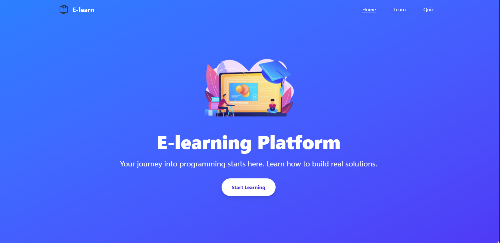

# 🧠 E-Learning Platform

**E-learning PLatform** is an interactive web platform designed to help new programmers learn the fundamentals of web development. Built with React, Tailwind CSS, and JavaScript, it provides structured lessons, simple quizzes, and hands-on examples to reinforce learning.

---

---

## 🚀 Features

- 📚 Interactive lessons covering HTML, CSS, and JavaScript
- ✅ “Show Output” examples to visualize code results
- 📝 Beginner-friendly quizzes with instant feedback
- 🎯 Clean, responsive UI using Tailwind CSS
- 💡 Static code viewer and educational layout
- 🔗 Page routing using React Router

---

## 🛠️ Tech Stack

| Category      | Tools Used                        |
|---------------|-----------------------------------|
| Frontend      | React, Tailwind CSS               |
| Routing       | React Router                      |
| Styling       | Tailwind Utility-First Framework  |
| Icons         | Lucide React                      |
| Hosting       | Vercel                            |

---

